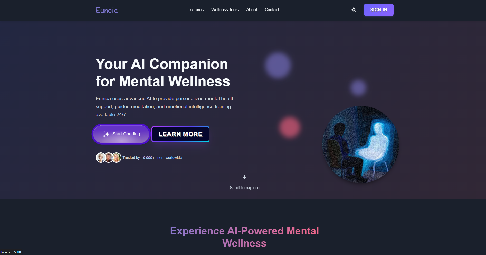
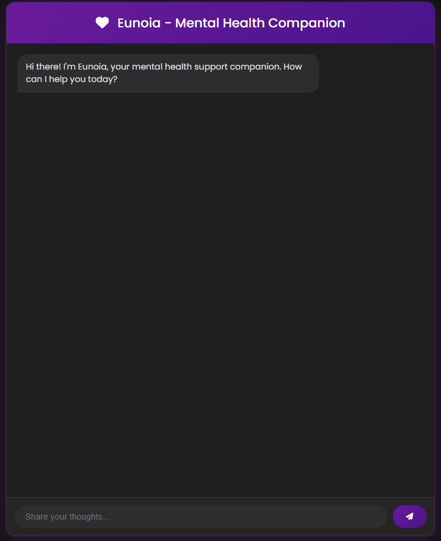
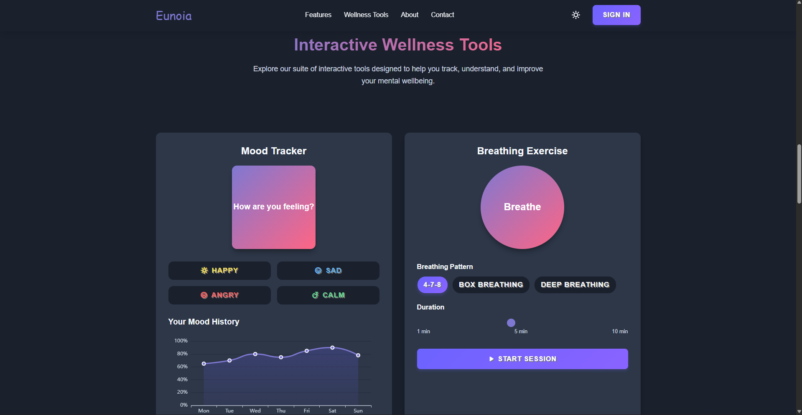
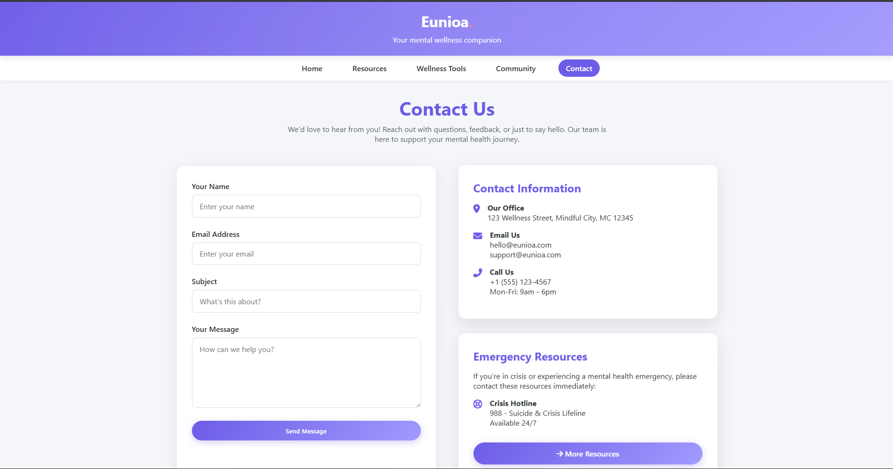
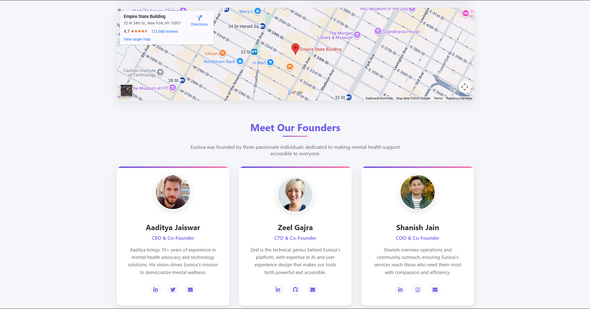

# 🧠 Eunoia - Mental Health Support Chatbot


## 📖 Description

Eunoia is an innovative, compassionate, and highly sophisticated mental health support chatbot meticulously crafted with Flask and powered by Google's cutting-edge Gemini AI. This groundbreaking application delivers an intuitive, user-friendly web interface for individuals seeking comprehensive mental health resources and empathetic support through seamless conversational AI interactions.

## ✨ Features

- **🤖 Compassionate AI Responses**: Leverages Google's Gemini 1.5 Flash model for empathetic and helpful mental health conversations
- **🌐 Web-Based Interface**: Clean, responsive web interface for easy access
- **💬 Real-Time Chat**: Instant messaging capabilities with persistent chat history
- **🧘 Mental Health Focused**: Specialized prompts designed for mental wellness support
- **🔒 Secure API Integration**: Environment-based configuration for API keys

## 📸 Screenshots

*Here are some screenshots showcasing the Eunoia mental health chatbot application:*

### Welcome Screen


### Chatbot Interface


### Wellness Tools


### Contact Page



## Prerequisites

- Python 3.7 or higher
- Google Gemini API key
- pip (Python package manager)

## Installation

1. **Clone the repository** (if applicable) or ensure you have the project files in your directory.

2. **Install required dependencies**:
   ```bash
   pip install flask google-generativeai python-dotenv
   ```

3. **Set up environment variables**:
   - Create a `.env` file in the root directory
   - Add your Google Gemini API key:
     ```
     GEMINI_API_KEY=your_api_key_here
     ```
   - Obtain an API key from [Google AI Studio](https://makersuite.google.com/app/apikey)

## Usage

1. **Run the Flask application**:
   ```bash
   python app.py
   ```

2. **Access the chatbot**:
   - Open your web browser and navigate to `http://localhost:5000`
   - Start chatting with Eunoia for mental health support

## Technologies Used

- **Backend**: Flask (Python web framework)
- **AI Model**: Google Gemini 1.5 Flash
- **Frontend**: HTML, CSS, JavaScript
- **Environment Management**: python-dotenv

## Notes

- Ensure your `.env` file is not committed to version control for security reasons
- The chatbot is designed to provide support and resources, not professional medical advice
- For production deployment, consider using a WSGI server like Gunicorn instead of Flask's built-in development server

## Contributing

Contributions to improve Eunoia are welcome. Please ensure any changes align with the compassionate and supportive nature of the application.

## License

[Add appropriate license information here]
